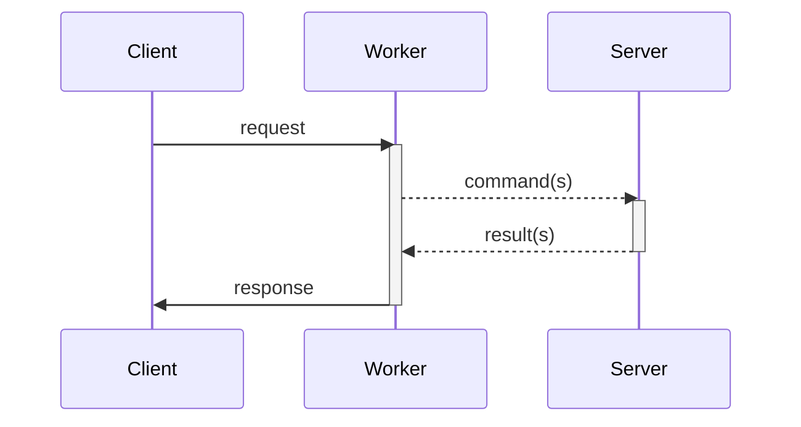
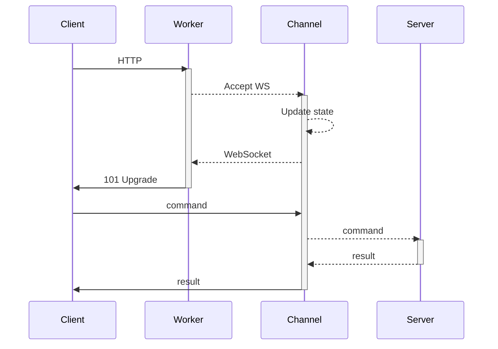

## HTTP

```mermaid
sequenceDiagram
  participant Client
  participant Worker
  participant Server
  Client->>Worker: request
  activate Worker
  Worker-->>Server: command(s)
  activate Server
  Server-->>Worker: result(s)
  deactivate Server
  Worker->>Client: response
  deactivate Worker
```

## WS

```mermaid
sequenceDiagram
  participant Client
  participant Worker
  participant Channel
  participant Server
  Client->>Worker: HTTP
  activate Worker
  Worker-->>Channel: Accept WS
  activate Channel
  Channel-->>Channel: Update state
  Channel-->>Worker: WebSocket
  Worker->>Client: 101 Upgrade
  deactivate Worker
  Client->>Channel: command
  Channel-->>Server: command
  activate Server
  Server-->>Channel: result
  deactivate Server
  Channel->>Client: result
  deactivate Channel
```
